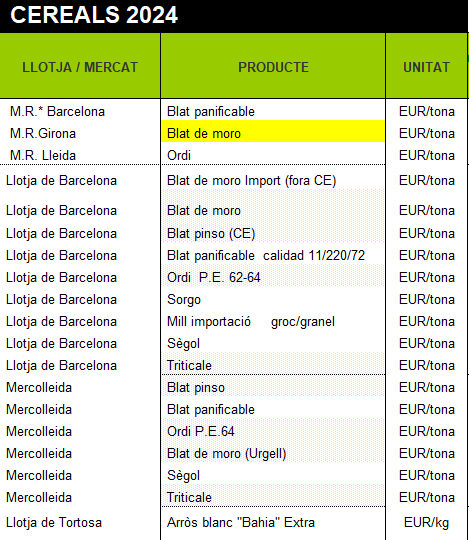

# Creació arxius per a Sèries Històriques

## Introducció

En aquest apartat s'explica quin es el procediment a seguir per a la creació  dels fixers de preus a partir de les dades proporcionades per la generalitat amb l'ajuda de Macros i Excel

## Materials

 - [Per accedir als documents de la generalitat clica aquí](https://agricultura.gencat.cat/ca/departament/observatori-agroambiental/estadistiques/observatori-agroalimentari-preus/preus-origen/llotges-mercats/productes-agricoles/index.html)

 - [Descarregar Macros](https://drive.google.com/drive/folders/1HJ7q8u6ZCWGBks0cR9Pcr28xWqqdXVOn?usp=sharing)

## Prerequisits

1. Preferiblement utilizat sistema operatiu Windows
2. Disposar d'Excel o Fulla de càlcul de google (Aquest tuorial es una guía per excel)
3. Haver descarregat els fitxers dels links superiors

## Passos per la Creació dels Arxius

### 0. Importar les Macros

Una vegada obert excel amb el document proporcionat per la generalitat, hem d'importar les macros per fer-les servir.
Cal accedir al apartat de `Programador`, i obrir la consola de `Visual Basic`, que podem observar a l'inici de la imatge.

!!! info "Obrir la pestanya Programador"
    No esta habilitada normalment, informar-se de com activar-la

Una vegada dins de la consola, importem les macros dins del projecte. Hem de fer clic dret a sobre del nom del document.

### 1. Adaptació del document

Una vegada tinguem els fitxers descarregats, necessitem adaptar-los per a que la Macro funcioni correctament. Els arxius de la generalitat tenen canvis, que s'han anat produint durant els anys.

- Assegurar-se de que totes les files tenen dades

- Eliminar les dades d'altres anys

### 2. Revisió dels noms dels Productes

Com bé sabem, els arxius son cambiants, per tant ens hem d'asegurar de que els noms dels productes coincideixen amb el que volem.

Per aixó em 

