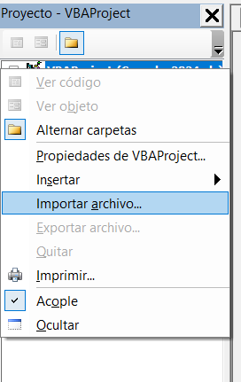
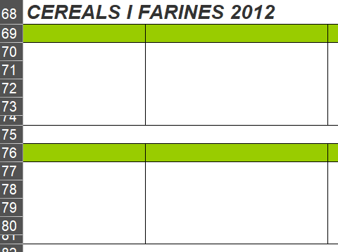
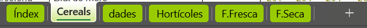
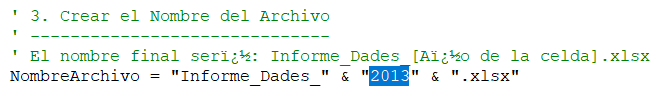
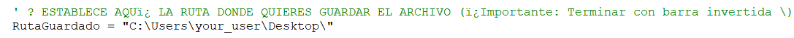

# ✔️ Creació arxius per a Sèries Històriques

## Introducció

En aquest apartat s'explica quin es el procediment a seguir per a la creació  dels fixers de preus a partir de les dades proporcionades per la generalitat amb l'ajuda de Macros i Excel

## Materials

 - [Per accedir als documents de la generalitat clica aquí](https://agricultura.gencat.cat/ca/departament/observatori-agroambiental/estadistiques/observatori-agroalimentari-preus/preus-origen/llotges-mercats/productes-agricoles/index.html)

 - [Descarregar Macros](https://drive.google.com/drive/folders/1HJ7q8u6ZCWGBks0cR9Pcr28xWqqdXVOn?usp=sharing)

## Prerequisits

1. Preferiblement utilizat sistema operatiu Windows
2. Disposar d'Excel o Fulla de càlcul de google (Aquest tuorial es una guía per excel)
3. Haver descarregat els fitxers dels links superiors

## Passos per la Creació dels Arxius

### 0. Importar les Macros

Una vegada obert excel amb el document proporcionat per la generalitat, hem d'importar les macros per fer-les servir.
Cal accedir al apartat de `Programador`, i obrir la consola de `Visual Basic`, que podem observar a l'inici de la imatge.

!!! info "Obrir la pestanya Programador"
    No esta habilitada normalment, informar-se de com activar-la

Una vegada dins de la consola, importem les macros dins del projecte. Hem de fer clic dret a sobre del nom del document.

### 1. Adaptació del document

!!! nota "Informació Complementària"
    Aquest i la resta s'apartats es realitzaràn amb un fitxer de l'any 2013

Una vegada tinguem els fitxers descarregats, necessitem adaptar-los per a que la Macro funcioni correctament. Els arxius de la generalitat tenen canvis, que s'han anat produint durant els anys.

- Assegurar-se de que totes les files tenen dades

- Eliminar les dades d'altres anys.

!!! nota "Informació Complementària"
    Eliminant la columna `B`, ja en tindriem suficient. La macro llegeix els productes de la columna `B` per selecionar les files que contenen els productes que busquem.

### 2. Revisió dels noms dels Productes

Com bé sabem, els arxius son cambiants, per tant ens hem d'asegurar de que els noms dels productes coincideixen amb el que volem abans d'aplicar les macros a qualsevol arxiu.

Per aixó em d'accedir a la consola de Visual Basic, per així poder modificar la macro i poder-la adaptar a les nostres necessitats.

Un cop sóm a la consola, hem d'obir el fitxer úbicat a `mòdulos` anomenat `SelectAndTransferItems` i modificar l'array següent al nostre gust.

!!! nota "Informació Complementària"
    Si afeigim més productes, tambè cal modificar el tamany de l'array. Es troba definit a l'apartat de variables a l'inici del codi.

### 3. Revisió i creació del les fulles a excel

La macro `SelectAndTransferItems` serà la que crei el nostre document final amb els preus. Peró per això, necessesitem modificar el nom de la fulla que contè els productes a `Cereals`, i crear una nova fulla anomenada `dades`.

Per últim, cal afeigir aquesta capçalera al full de `dades`

| Mercat | Producte | Unitat | Preu | Data - Día | Data - Setmana | Data - Mes |
| :----: | :------: | :----: | :--: | :--------: | :------------: | :--------: |

### 4. Executar la Macro `SelectAndTranferItems`

Una vegada ens hem assegurat de que el fitxer esta ben formatat, i que no hi haurà errors, podem executar la Macro.

Aquesta, marcarà de color `groc` quins són els productes que ha selecionat i els escriurà al full `dades`, d'aquesta manera podem assegurar-nos de que ha generat l'arxiu amb totes les files desitjades.

### 5. Guardar el nou fitxer `dades`

Disposem d'una macro anomenada `RenameAndSaveToPath` , la qual guardarà els arxius a l directori que indiquis. A més tambè afegeix un nom igual per a tots els arxius amb el seu any.

- Cambiar l'any manualment

- Cambiar la destinació

## Què fa cada Macro?

- `SelectAndTranferItems : ` Llegeix la columna 'B' fins que no hi haigi més dades. Selecciona cada fila que coincideix amb els valors de l'array, i trasnforma les files al format deitjat a la fulla 'dades'

- `RenameAndSaveToPath : ` Per més agilitat, renombra i guarda el document 'dades' al path especificat

- `FindProducts: ` Simplement marca en groc els productes que contè l'array, pot servir per fet proves abans d'executar 'SelectAndTransferItems' 