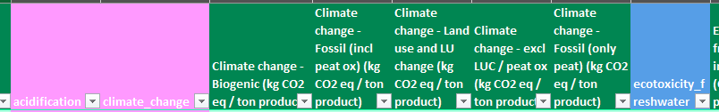
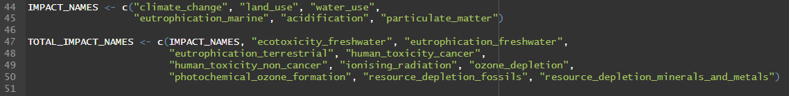

# ✔️ Format i restriccions dels arxius del dashboard d'emissions

## Arxiu de dades mediambientals

Aquest arxiu és la font principal de dades d'emissions per a cada ingredient, organitzades per procedència. Inclou els indicadors mediambientals necessaris per al càlcul de l'impacte ambiental al dashboard.

S'estructura en 5 fulls de treball, descrits en el mateix ordre en què apareixen a l'Excel:

### 1. Mass Allocation

Full principal d'on s'obtenen les dades d'emissions dels ingredients que alimenten el dashboard.

#### Característiques NO modificables

Per garantir el funcionament correcte del sistema, els noms de les capçaleres s'han de mantenir exactament iguals.

Capçaleres no modificables:

```text
- ingredient
- group
- origen
- default_origen
- acidification
- climate_change
- ecotoxicity_freshwater
- particulate_matter
- eutrophication_marine
- eutrophication_freshwater
- eutrophication_terrestrial
- human_toxicity_cancer
- human_toxicity_non_cancer
- ionising_radiation
- land_use
- ozone_depletion
- photochemical_ozone_formation
- resource_depletion_fossils
- resource_depletion_minerals_and_metals
- water_use
```

#### Característiques modificables

Les capçaleres estan diferenciades en 3 colors:

- Rosa: emissions predeterminades del dashboard.
- Blau: emissions afegides per al càlcul de la petjada mediambiental.
- Verd: emissions no utilitzades actualment al dashboard.



Els colors es poden modificar sense afectar el funcionament del dashboard, ja que la lectura es fa pels noms de les capçaleres.

Si es vol afegir una emissió nova, cal incorporar-la manualment al codi. La secció corresponent es troba a `Global.R`:



També es poden afegir les files necessàries, sempre mantenint l'estructura de columnes.

### 2. Environmental_Footprint

Full complementari amb dades de petjada ambiental dels ingredients procedents de fonts externes.

### 3. Tala_Ingredientes_DST

Full de suport per a la correspondència entre ingredients i estructures internes de càlcul.

### 4. Tabla_Resultados

Full on es consoliden els resultats finals dels càlculs ambientals.

### 5. Unitats nous ingredients

Vam haver d'extreure dades d'un arxiu anomenat `dades_Agribalyse`, ja que hi havia més quantitat d'ingredients que conformen les dietes que no pas a l'arxiu de dades mediambientals. Això produïa errors en els càlculs.

Aquí es recullen les unitats dels nous ingredients per a cada emissió predeterminada:


Aquí es mostra informació complementària sobre aquests ingredients:


## Arxiu d'ingredients utilitzats

Aquest arxiu recull els ingredients utilitzats al sistema i serveix de base per a la configuració de les dietes. Nomès contè un full.

#### Característiques no modificables

Les capçaleres no es poden modificar:
```text
- step	
- ingredient	
- diet	
- prop
```


## Arxiu de dades de transport

Aquest arxiu conté les emissions associades al transport dels ingredients des del país d'origen.

L'arxiu es divideix en 4 fulls diferents, descrits en el mateix ordre que es troben a l'Excel:

### 1. Emissió per país

El càlcul està separat pels tipus de transport necessaris per arribar a Espanya, segons el país de procedència.


Hi ha països amb dades buides. Això indica que, per als ingredients seleccionats, aquests països no s'utilitzen com a procedència.

#### Característiques no modificables

Hi ha algus paisos amb dades vuides, vol dir que no són necessàries, els ingredients seleccionats no utilitzen aquells paisos com a pas de provinença.

Capçaleres no modificables:
```text
- origen
- truck
- train
- barge
- ship
- total
- climate_change
- land_use
- water_use
- eutrophication_marine
- acidification
- particulate_matter
```

La columna `Origen` ha de correspondre amb els orígens definits a l'arxiu de dades mediambientals. No es recomana afegir-ne de nous si no existeixen a la font principal.

#### Característiques modificables

Es poden afegir més files o ampliar dades dels orígens existents.

### 2. Factors d'emissió

Full amb factors de conversió utilitzats en el càlcul de l'impacte del transport.


### 3. Distribució de quilòmetres per origen

Full amb la distribució de distàncies per tipus de transport segons l'origen de cada ingredient.


### 4. Informació

Full de suport amb informació addicional per a la interpretació i validació de dades de transport.
